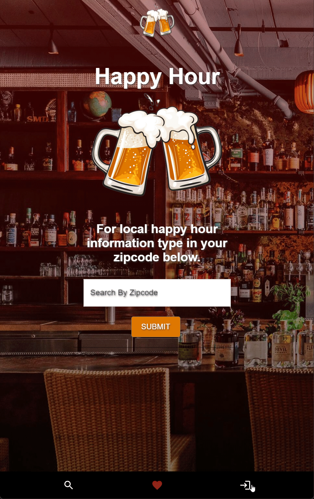

# HAPPY-HOUR

## Description

This application allows users to search for restaurants in their provided zip code, where they can get drinks for a cheap price and also review those "Happy Hour" locations. This app searches by the zipcode you provide and gives you a list of the restaurants with "Happy Hours" that match your criteria.

## [Try it yourself!](https://desolate-earth-02940.herokuapp.com/)

Click on "Try it yourself" to get the link to the repository!

## Demo



## Installation

To edit this application, you need a coding software like the free [VScode](https://code.visualstudio.com/download), a working web browser like [Mozilla](https://www.mozilla.org/en-US/firefox/new/), a way to store databases like [MongoDB](https://www.mongodb.com/) along with [MongodbCompass](https://www.mongodb.com/products/compass), and a way to test the backend/frontend queries/mutations using the software [ApolloGraphql](https://www.apollographql.com/). For the rest of the requirements, you just need to run ```npm i``` to get the neccessary packages from the package.json.

## Usage

Unless you're using this project as a boiler plate or as example code, you can instead just go straight to the [herokuapp](https://desolate-earth-02940.herokuapp.com/) instead. Otherwise you're free to edit the `models/schemas` in the `server` folder along with the `utils` in the `client` folder in order to change the data you want to connect. Make sure to ```.cp .env.Example .env``` in order to get a copy of the environmental variables that you need for the server to launch. Also connect an online database like [MongodbAtlas](https://www.mongodb.com/atlas/database). 


## Technology

Here is the technology used along with links to them where applicable:

- [VScode](https://code.visualstudio.com/download)
- [MongoDB](https://www.mongodb.com/)<br>
- [MongodbCompass](https://www.mongodb.com/products/compass)<br>
- [ApolloGraphql](https://www.apollographql.com/)<br>
- [REACT](https://reactjs.org/)<br>
- [Mui](https://mui.com/)<br>
- [MongodbAtlas](https://www.mongodb.com/atlas/database)<br>
- [Heroku](https://desolate-earth-02940.herokuapp.com/)<br>
- JavaScript<br>

## Credits

This is the group of people who worked on this project: <br>
- Github: [David Luu](https://github.com/MaestroLuu/) 
- Github: [Marco Flores](https://github.com/JaggedComet/)
- Github: [Luka Licheli](https://github.com/lukalicheli/)
- Github: [Chris Muto](https://github.com/chrismuto/)

## Questions

If you have any additional questions regarding this application, please contact us via the channels provided below:<br />
________________________________________
Github: https://github.com/MaestroLuu<br>
Email: DLuu.developer@gmail.com<br>
________________________________________
Github:https://github.com/JaggedComet/<br>
Email: MarcoFlores1029@gmail.com<br>
________________________________________
Github: https://github.com/lukalicheli/<br>
Email: lukalicheli@gmail.com<br>
________________________________________
Github: https://github.com/chrismuto/<br>
Email: chrismuto@gmail.com<br>
